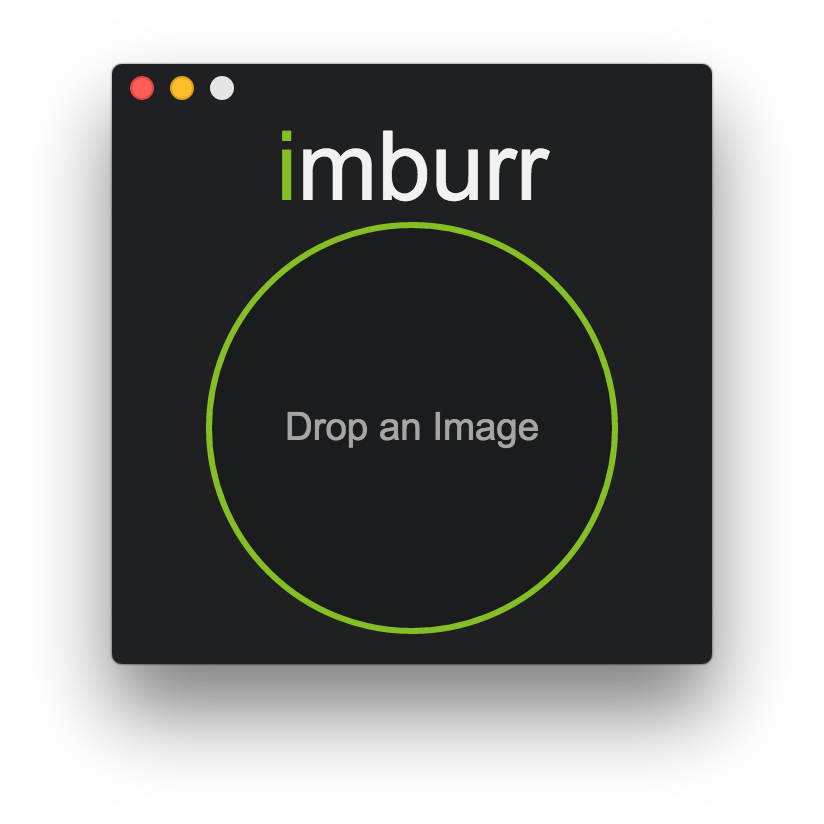

# imburr

> Easy imgur uploads




## Dev

```
$ npm install
```

### Run

```
$ npm start
```

### Build

```
$ npm run mac-bundle
$ npm run win-bundle
$ npm run linux-64-bundle
```

Builds the app for OS X, Linux, or Windows, using [electron-packager](https://github.com/maxogden/electron-packager).


## License

MIT © [Larry Wu](http://larrywu.com/)
